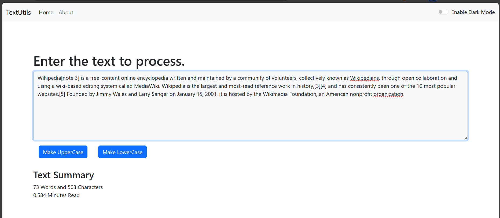

# React Projects

---

These projects are part of my learning experience with React. They demonstrate my progress in React hooks, handling API requests, and implementing pagination to structure content based on page numbers. With this learning process, I gained insights into creating modular React components and efficiently passing props, enabling me to build more adaptable applications.

## TextUtils App

---

## News App

---

